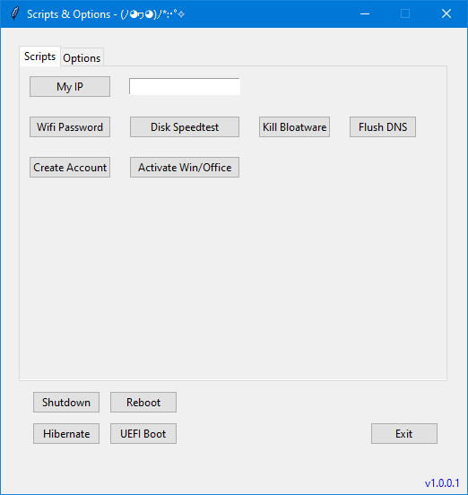

# WinFunct App

Welcome to WinFunct, the random utility app for Windows with functions and options that have pissed me off to search every goddamn time I need them 🤭🙈

## Description

WinFunct is a Python application that provides various scripts and options to enhance your Windows experience. It offers a user-friendly graphical interface where you can easily access different functions and settings.

## Features

- **Wi-Fi Password Viewer**: View and copy the passwords of saved Wi-Fi networks.
- **IP Address Checker**: Retrieve and display your public IP address.
- **Disk Speedtest**: Test the speed of a specific disk drive on your system.
- **Bloatware Killer**: Uninstall non-essential apps and remove unnecessary PWA shortcuts.
- **Flush DNS**: Release and renew IP configurations and flush DNS cache.
- **User Account Creation**: Create a new Windows user account with admin privileges. _(This is deactivated due to a bug)_
- **Windows Activation**: Activate Microsoft Windows and Office products.
- **System Tools**: Quick access to various Windows system tools and settings.
- **Shutdown, Reboot, UEFI Boot, Sleep**: Perform power-related actions with ease.

## Requirements

- [Python 3.x](https://www.python.org/downloads/)
- [Git for Desktop](https://git-scm.com/downloads)

## Auto Installation

1. Navigate to the directory of your choice, click into the address bar, type **"cmd"** and hit Enter.
2. Clone the repository with the command: `git clone https://github.com/df8819/WinFunct.git` in the **CMD** Window.
3. Double click: **"Update.bat"**.
4. For later instances, use: **"Run.bat"**

## Manual Installation

1. Navigate to the directory of your choice, click into the address bar, type **"cmd"** and hit Enter.
2. Clone the repository with the command: `git clone https://github.com/df8819/WinFunct.git` in the **CMD** Window.
3. Navigate to the project directory: `cd WinFunct`
4. Install the required libraries: `pip install -r requirements.txt`
5. Run the app: `python winfunct.py`

## Usage

1. Launch the app by executing `winfunct.py`.
2. Select the desired function or option from the available tabs.
3. Follow the on-screen instructions to perform the selected task.
4. Enjoy the enhanced functionality and convenience provided by WinFunct!

## Notes

🌟 Star this repository if you find it helpful!

- _Some features require administrative privileges to function properly. Make sure to run the app with administrator rights._
- _The "Kill Bloatware" script still needs a little love._
- _GUI changes slightly from time to time and the picture won't be updated every time_
- _Create user as admin function doesn't work on all systems (needs to be fixed)_

