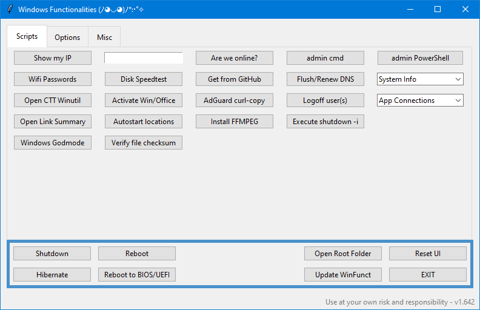
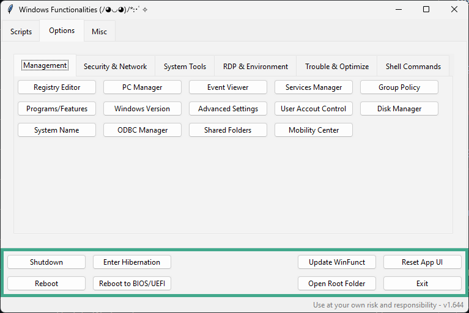
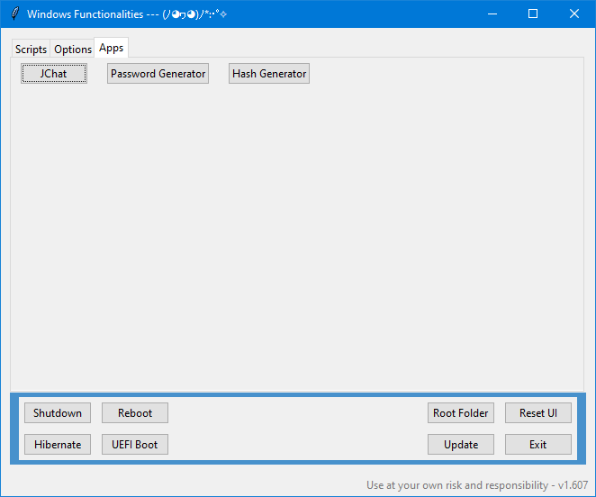

# WinFunct App

Custom utility app for Windows to speed up functions, scripts and options which have annoyed me to search/execute every time I needed them 👀

## Description / Features

This app combines a lot of useful functions or scripts for managing Windows. I consider it kinda useful after v1.6xx:

- Extract Wifi passwords, do disk speedtest or release/renew DNS.
- Execute ChrisTitusTech beloved WinUtils, the MAS activation or a run checksum verifier with all encryption algos selectable.
- Link opener for a bunch of useful stuff, Win "Godmode" settings, system info extraction/comparison or checking what apps have an active internet connection.
- **Options Tab** is a settings dump for stuff that's usually annoying to find or sort of hidden in Windows.
- **Apps Tab** has some fun stuff like my old python ChatGPT GUI, a hash cracker or a password/passphrase generator 👍

## Requirements

- [Python 3.x](https://www.python.org/downloads/)
- [Git for Desktop](https://git-scm.com/downloads/)

## Usage

- Either download the latest [Release](https://github.com/df8819/WinFunct/releases), unpack the .zip file, right-click and select **Run as administrator** or:

**1.** Navigate to the directory of your choice, click into the address bar, type **"cmd"** and hit Enter.

**2.** Clone the repository with the command: `git clone https://github.com/df8819/WinFunct.git` in the **cmd** Window.

**3.** Double click **"Install.bat"**. This will install all dependencies and update the cloned repository. Use the **"Update"** button in the app to update at later stages.

**4.** Double click **"Run.bat"**. _(The typical `python *.py` cmd command will not work, as the app demands elevated rights via temporary created script.)_

**5.** It may requires you to add an exclusion for the folder you have cloned this repo in Windows **"Virus & threat protection settings > Manage settings > Add or remove exclusions"**, as many scripts in this app will auto-flag it as malicious🤐

## Known Issues

- _Several files like `ui.py` or `functions.py` are part of an unfinished refractor process that will happen. Somewhen.._ 😶

- _**"Kill Bloatware"** needs an overhaul and may don't work as intended. Please use **"CCT Winutil"** and its GUI to de-bloat Windows, that works like a charm_ 🤷‍♂️

- _Screenshots may not show the latest version of the app. (Theme-Selector with ttkbootstrap is planned for the future)_ 👀

## Screenshots

