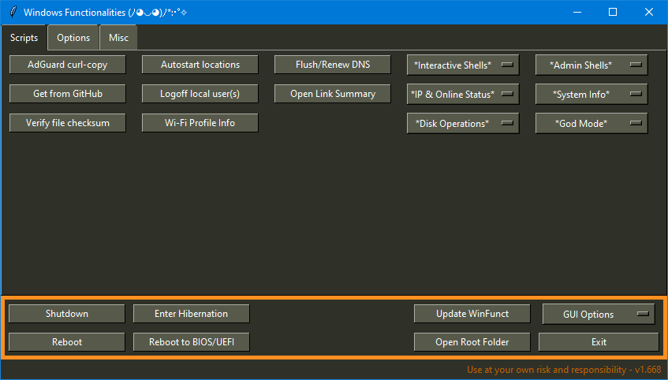
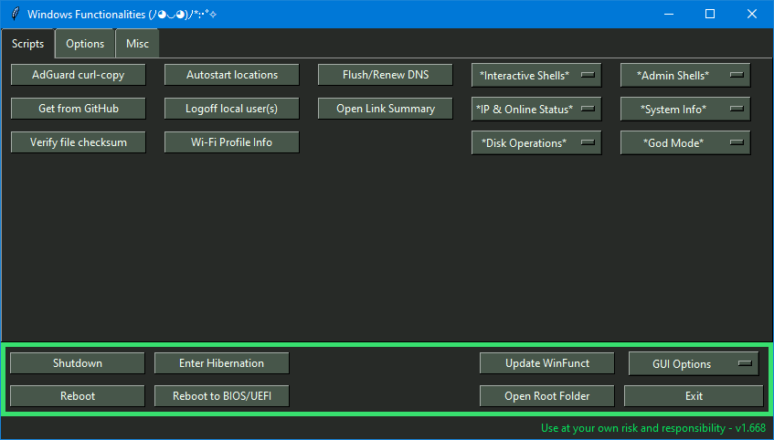
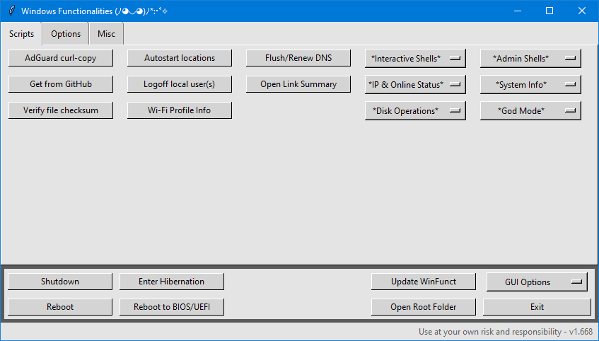
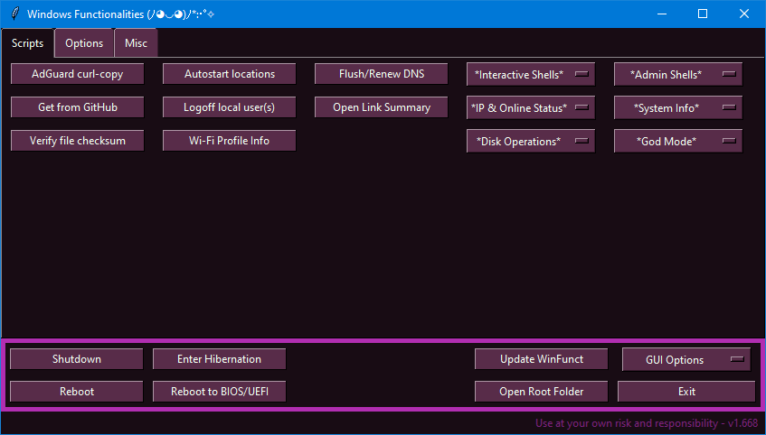

## Description / Features

This app combines a lot of useful functions or scripts for managing Windows:

- Extract Wifi passwords, disk speedtest, release/renew DNS, website online checker or logoff users.

- Execute ChrisTitusTech's beloved WinUtils, the MAS script or run a checksum verifier with all encryption algorithms selectable.

- Link opener for a bunch of useful stuff, Win "Godmode" settings, system info extraction/comparison or checking what apps have an active internet connection.

- **Options Tab** is a settings dump for stuff that's usually annoying to find or sort of hidden in Windows.

- **Apps Tab** has some fun stuff like my old python ChatGPT GUI, a hash cracker or a password/passphrase generator 👍

## Requirements
#### Release version:
- Download the latest [Release](https://github.com/df8819/WinFunct/releases), which has no other dependencies.

#### Cloned repository:
- [Python 3.x](https://www.python.org/downloads/)
- [Git for Windows](https://git-scm.com/downloads/)

## Usage

- Either download the latest [Release](https://github.com/df8819/WinFunct/releases), unpack the .zip file, right-click WinFunct.exe and select **Run as administrator** or:

**1.** Navigate to the directory of your choice, click into the file explorer's address bar, type **"cmd"** _(overwrite existing path)_ and hit Enter.

**2.** Clone the repository with the command: `git clone https://github.com/df8819/WinFunct.git` in the appeared **cmd** Window.

**3.** Double click **"Install.bat"**. This will install all dependencies and update the cloned repository. Use the **"Update WinFunct"** button in the app to update at later stages.

**4.** Double click **"Run.bat"**. _(The typical `python WinFunct.py` cmd command will not work, as the app demands elevated rights via temporary created script.)_

**(5.)** You may need to add an exclusion for the folder you have cloned this repo in Windows under **"Virus & threat protection settings > Manage settings > Add or remove exclusions"**

## Known Issues / Comments

- _Thank you for using my App. Feedback is always welcome_ ✌
- _This is my 'learning by doing' app. It provides useful functions, but expect some of them to misbehave from time to time_ 😇

## Screenshots

