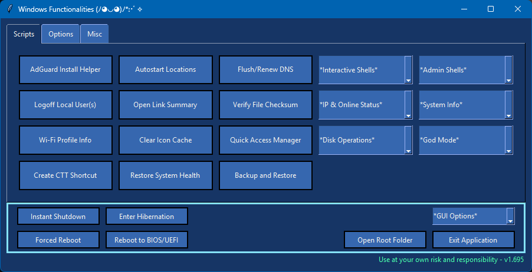
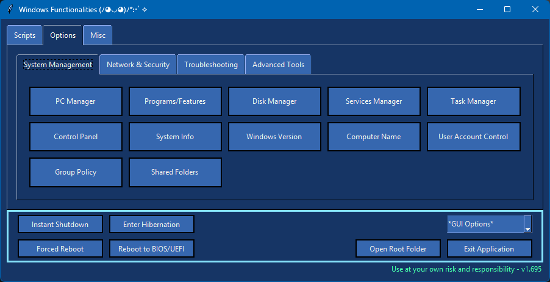

# WinFunct - Windows Management Tool

## Description / Features

This app combines a variety of useful functions and scripts for managing Windows:

### Core Functions
- Extract Wi-Fi passwords, disk speedtest, release/renew DNS, website online checker, or logoff users.
- Execute ChrisTitusTech's beloved WinUtils, the MAS script, or run a checksum verifier with all encryption algorithms selectable.

### Advanced Tools
- Link opener for useful resources, Win "Godmode" settings, system info extraction/comparison, or checking what apps have an active internet connection.

### Tabs & Features
- **Options Tab**: A settings dump for stuff that's usually annoying to find or hidden in Windows.
- **Apps Tab**: Fun stuff like a Python ChatGPT GUI, hash cracker, password/passphrase generator 👍

---

## Requirements

### Release Version
- Download the latest [Release](https://github.com/df8819/WinFunct/releases), which has no other dependencies.

### Cloned Repository
- [Python 3.x](https://www.python.org/downloads/)
- [Git for Windows](https://git-scm.com/downloads)

---

## Usage

### Method 1: Download the Latest Release
1. Download the latest release from [GitHub](https://github.com/df8819/WinFunct/releases).  
1.1. (Unpack the `.zip` file if downloaded as .zip.)
3. Right-click `WinFunct.exe` and select **Run as administrator**.

### Method 2: Clone the Repository
1. Open Command Prompt in your desired directory:
   - Navigate to the directory of your choice.
   - Click into the file explorer's address bar, type `cmd`, and hit Enter.
2. Clone the repository with the command:  
   ```bash
   git clone https://github.com/df8819/WinFunct.git
   ```
3. Double-click **"Install.bat"** to install all dependencies and update the cloned repository.
4. Double-click **"Run.bat"** to launch the application.

### Note:
- You may need to add an exclusion for the folder in Windows Defender:  
  `Windows > Virus & threat protection settings > Manage settings > Add or remove exclusions`

---

## Comments

- Thank you for using my app! Feedback is always welcome ✌️
- This is my 'learning by doing' app. It provides useful functions, but expect some of them to misbehave or maybe crash from time to time.

---

## Screenshots

### Main App
Change GUI colors in the app:  
`*GUI Options* > [1] Theme Selector`  
You can add your own colors and variants by editing `"UI_themes.json"`.


<!--


<hr style="border: 5px solid;" />

## Screenshots - Functions


-->